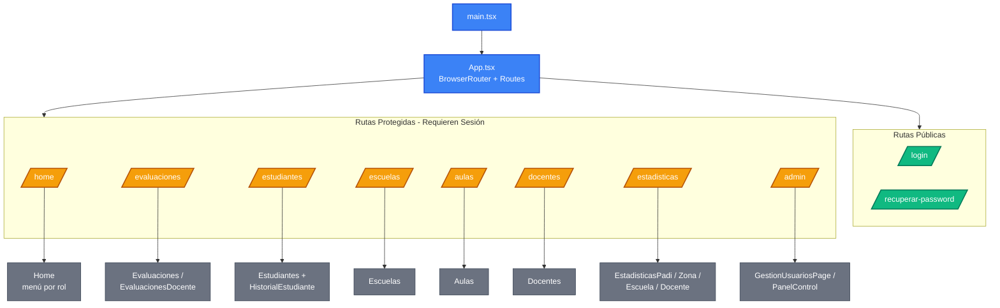

# PADI – Frontend

Interfaz web del sistema de evaluaciones del Programa de Atención al Desarrollo Infantil (PADI), desarrollada como Trabajo Práctico Profesional en la Universidad de Buenos Aires.

Construida con React 19 + TypeScript + Vite y desplegada en Firebase Hosting.  
Implementa control de acceso por rol, visualización de estadísticas y un flujo completo de evaluación del desarrollo infantil.

**Deploy (producción):** https://fundacionpadi-41cb2.web.app  
**Documentación funcional:** [docs/documentacion-componentes-y-flujos.md](docs/documentacion-componentes-y-flujos.md)

---

## Índice

1. [Contexto y propósito](#contexto-y-propósito)
2. [Features principales](#features-principales)
3. [Stack tecnológico](#stack-tecnológico)
4. [Arquitectura y estructura del proyecto](#arquitectura-y-estructura-del-proyecto)
5. [Roles y control de acceso](#roles-y-control-de-acceso)
6. [Páginas y flujos de navegación](#páginas-y-flujos-de-navegación)
7. [Guía para desarrolladores](#guía-para-desarrolladores)
8. [Variables de entorno](#variables-de-entorno)
9. [Testing](#testing)
10. [CI/CD y despliegue](#cicd-y-despliegue)
11. [Decisiones de diseño](#decisiones-de-diseño)

---

## Contexto y propósito

El frontend de PADI es la interfaz que utilizan los operadores de la Fundación para gestionar y aplicar evaluaciones del desarrollo infantil. La aplicación da soporte a cuatro roles diferenciados, cada uno con acceso a un conjunto distinto de funcionalidades:

- **Equipo PADI:** administración global del sistema, gestión de usuarios, estadísticas por zona y escuela.
- **Encargado de zona:** supervisión de escuelas y estadísticas dentro de su zona.
- **Director:** gestión de su escuela, docentes, aulas y estudiantes.
- **Docente:** aplicación de evaluaciones y seguimiento de estudiantes asignados.

---

## Features principales

### Evaluaciones
- Wizard paso a paso para la aplicación de evaluaciones por área de desarrollo.
- Soporte para preguntas evaluables y observables, con indicador visual del tipo de pregunta.
- Soporte para preguntas de puntuación invertida (el punto se otorga cuando la respuesta es "No" para enfatizar conductas preocupantes).
- Revisión de respuestas con colores por corrección y posibilidad de corregir respuestas.
- Estados de evaluación: No iniciada / En progreso / Aprobada / Desaprobada.

### Gestión institucional
- ABM completo de escuelas, aulas, zonas, docentes, directivos y estudiantes.
- Asignación de docentes y estudiantes a aulas con fechas de vigencia.
- Historial de evaluaciones por estudiante.

### Estadísticas
- Dashboards de resultados por escuela, zona, docente y nivel PADI.
- Gráficos interactivos con Recharts.
- Exportación de datos a Excel (ExcelJS).

### Componentes y UI
- Sistema de diseño basado en Material UI con tema centralizado.
- Catálogo de componentes aislados con Storybook.
- Diseño responsivo con soporte para dispositivos móviles.

### Autenticación
- Login, recuperación de contraseña y cambio de contraseña temporal.
- Control de acceso por rol con redirección automática según el perfil del usuario.

---

## Stack tecnológico

### Stack principal

| Tecnología | Rol |
|---|---|
| **React 19 + TypeScript** | Biblioteca de UI y tipado estático |
| **Vite** | Entorno de desarrollo y bundler de producción |
| **React Router DOM v7** | Enrutamiento del lado del cliente |
| **Material UI (MUI) v6** | Sistema de componentes visuales |
| **Firebase Hosting** | Despliegue de producción |

---

## Arquitectura y estructura del proyecto

La aplicación sigue una **arquitectura orientada a páginas** donde cada vista del sistema corresponde a una página, apoyada en una capa de API centralizada y componentes reutilizables.

```
frontend/
├── src/
│   ├── api/                  # Cliente HTTP y funciones por dominio de negocio
│   │   ├── auth.ts           # Instancia axios + helpers de autenticación
│   │   ├── evaluaciones.ts   # Evaluaciones, preguntas y respuestas
│   │   ├── estudiantes.ts    # Estudiantes y matrículas
│   │   ├── escuelas.ts       # Escuelas y directivos
│   │   ├── docentes.ts       # Docentes y asignaciones
│   │   ├── estadisticas.ts   # Endpoints de estadísticas
│   │   └── ...               # Un módulo por dominio
│   ├── components/           # Componentes reutilizables y vistas compuestas
│   │   ├── evaluaciones/     # Wizard, revisión, sidebar
│   │   ├── estadisticas/     # Gráficos y dashboards
│   │   └── ...
│   ├── pages/                # Pantallas principales del sistema
│   │   ├── estadisticas/     # Dashboards por rol
│   │   ├── auth/             # Flujos de autenticación
│   │   └── ...               # Una página por sección
│   ├── utils/                # Utilidades compartidas (permisos, formateo)
│   ├── App.tsx               # Ruteo principal y control de acceso
│   ├── main.tsx              # Punto de entrada de Vite
│   └── theme.ts              # Tema visual centralizado (MUI)
├── test/                     # Pruebas del frontend
│   ├── api/                  # Tests de funciones del cliente HTTP
│   ├── utils/                # Tests de utilidades puras
│   └── setup.ts              # Mocks globales (localStorage, fetch)
├── docs/                     # Documentación funcional y complementaria
├── .env                      # Apunta al backend de producción
├── .env.local                # Override local para desarrollo (no se commitea)
├── .env.test                 # URL fija para los tests
├── vite.config.ts
├── vitest.config.ts
└── package.json
```

### Flujo de navegación



---

## Roles y control de acceso

La aplicación implementa control de acceso basado en roles y se usa para:

- Redirigir al usuario a su página de inicio correspondiente tras el login.
- Mostrar u ocultar elementos de navegación según el rol activo.
- Restringir el acceso a rutas protegidas desde `App.tsx`.

| Rol | Acceso |
|---|---|
| Equipo PADI | Administración global: usuarios, escuelas, zonas, estadísticas PADI |
| Encargado de Zona | Escuelas y estadísticas de su zona |
| Director | Su escuela: aulas, docentes, estudiantes, evaluaciones, estadísticas |
| Docente | Sus evaluaciones y los estudiantes de sus aulas |

---

## Páginas y flujos de navegación

### Autenticación
- `Login` — Inicio de sesión con email y contraseña.
- `SolicitarRecuperoPassword` — Solicitud de recuperación de contraseña por email.
- `ActualizarContrasena` — Ingreso de nueva contraseña desde el link de recuperación.
- `CambiarContrasenaTemporal` — Cambio obligatorio de contraseña en el primer login al ser invitado a la plataforma por un administrador.

### Gestión institucional
- `Escuelas` — Listado, alta, edición y baja de escuelas.
- `Aulas` — Gestión de aulas y asignación de docentes y estudiantes.
- `Docentes` — Alta y gestión de docentes.
- `Directivos` — Asignación de directivos a escuelas.
- `Zonas` — Gestión de zonas (equipo PADI).
- `GestionUsuarios` — Administración de usuarios del sistema.

### Evaluaciones
- `Evaluaciones` — Vista del equipo PADI con todas las evaluaciones del sistema.
- `EvaluacionesDocente` — Vista del docente con sus evaluaciones asignadas.
- `Estudiantes` — Listado de estudiantes con acceso al historial.
- `HistorialEstudiante` — Historial de evaluaciones de un estudiante específico.

### Estadísticas
- `EstadisticasPadi` — Dashboard global para el equipo PADI.
- `EstadisticasZona` — Dashboard por zona para encargados.
- `EstadisticasEscuela` — Dashboard por escuela para directores.
- `EstadisticasDocente` — Dashboard personal para docentes.

### Otros
- `Home` — Menú principal adaptado al rol del usuario.
- `PanelControl` — Panel de administración del sistema.
- `Perfil` — Vista y edición del perfil del usuario.

---

## Guía para desarrolladores

### Prerrequisitos

- Node.js 18 o superior.
- npm.

### Instalación y desarrollo

```bash
# Clonar el repositorio e instalar dependencias
git clone <url-del-repositorio>
cd frontend
npm install

# Iniciar el servidor de desarrollo con HMR en http://localhost:5173
npm run dev
```

### Build de producción

```bash
npm run build
```

Compila TypeScript y genera los archivos estáticos en `dist/`, listos para despliegue.

### Vista previa del build

```bash
npm run preview
```

Sirve el build de producción localmente para verificar el resultado antes de desplegar.

### Storybook

```bash
# Iniciar el servidor de Storybook en http://localhost:6006
npm run storybook

# Generar build estático de Storybook
npm run build-storybook
```

### Lint

```bash
npm run lint
```

---

## Variables de entorno

La URL del backend se configura con la variable `VITE_API_URL`.

| Archivo | Propósito |
|---|---|
| `.env` | Apunta al backend de producción (Firebase Cloud Functions) |
| `.env.local` | Override local para desarrollo (no se commitea) |
| `.env.test` | URL fija para los tests (`http://localhost:3000`) |

### Con backend Docker

```env
VITE_API_URL=http://localhost:8080
```

### Con emulador de Firebase

```env
VITE_API_URL=http://127.0.0.1:5001/fundacionpadi-41cb2/us-central1/api
```

> El backend debe estar corriendo antes de levantar el frontend. Ver el [README del backend](../backend/README.md).

---

## Testing

El proyecto usa [Vitest](https://vitest.dev/) con un umbral mínimo de cobertura del **70%** en líneas, funciones, ramas y sentencias.

### Comandos

```bash
# Modo watch (re-ejecuta al guardar cambios)
npm run test

# Ejecución única (ideal para CI)
npm run test:run

# Ejecución única con reporte de cobertura
npm run test:coverage
```

### Qué se testea

**`test/utils/permissions.test.ts`:** funciones puras de `src/utils/permissions.ts`, verificando la lógica de permisos por rol.

**`test/api/*.test.ts`:** funciones del cliente HTTP en `src/api/`, verificando endpoints, parámetros de query, mapeo de datos y manejo de errores.

### Configuración

| Aspecto | Detalle |
|---|---|
| Framework | Vitest v3 en entorno `node` |
| Configuración | `vitest.config.ts` en la raíz |
| Variables de entorno | `.env.test` con `VITE_API_URL=http://localhost:3000` |
| Setup global | `test/setup.ts` registra mocks de `localStorage` y `fetch` |
| Mocking | `vi.mock` + `vi.hoisted` para aislar el cliente axios |

### Reporte de cobertura

```bash
npm run test:coverage
```

Genera reporte en terminal, `coverage/index.html` y `coverage/lcov.info`.  
Los archivos medidos son `src/api/**` y `src/utils/**`. `src/api/auth.ts` está excluido por ser infraestructura compartida.

---

## CI/CD y despliegue

### Deploy a producción

El deploy se realiza automáticamente mediante el pipeline de GitHub Actions ante cada push a `main`.

El pipeline ejecuta:
1. Instalación de dependencias (`npm ci`).
2. Compilación (`npm run build`).
3. Deploy a Firebase Hosting en el proyecto `fundacionpadi-41cb2`.

Para desplegar manualmente:

```bash
firebase deploy --only hosting
```

### Separación de entornos

| Entorno | Backend | URL frontend |
|---|---|---|
| Producción | Firebase Cloud Functions (PROD) | https://fundacionpadi-41cb2.web.app |
| Desarrollo local | Docker (`localhost:8080`) o emulador (`localhost:5001`) | http://localhost:5173 |

La separación se logra configurando `VITE_API_URL` en `.env.local` para apuntar al backend de desarrollo.

---

## Decisiones de diseño

### Tema visual centralizado
Todos los tokens de diseño (colores, tipografía, espaciados) se definen en `src/theme.ts` y se inyectan mediante el `ThemeProvider` de MUI. Esto asegura consistencia visual en toda la aplicación y facilita futuros ajustes de identidad visual sin dispersión en el código.

### Un módulo de API por dominio
Cada entidad del sistema tiene su propio módulo en `src/api/` (evaluaciones, estudiantes, escuelas, etc.). Esto facilita la localización de código, el testing aislado y la evolución independiente de cada dominio sin afectar al resto.

### Tests de contrato con el backend
Los tests de `src/api/` verifican que los nombres de campos, rutas y parámetros coincidan con lo que el backend espera. Dado que frontend y backend se desarrollan en repositorios separados, esta práctica detecta tempranamente desincronizaciones semánticas entre capas.

### Storybook para desarrollo de componentes
Los componentes visuales complejos (wizard de evaluación, revisión, sidebar) se desarrollan en aislamiento con Storybook antes de integrarse en las páginas. Esto reduce el ciclo de feedback durante el desarrollo de UI y sirve como documentación viva del sistema de diseño.
